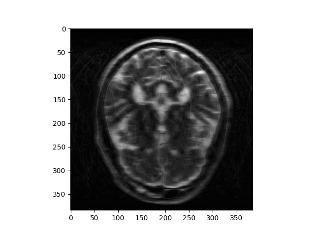
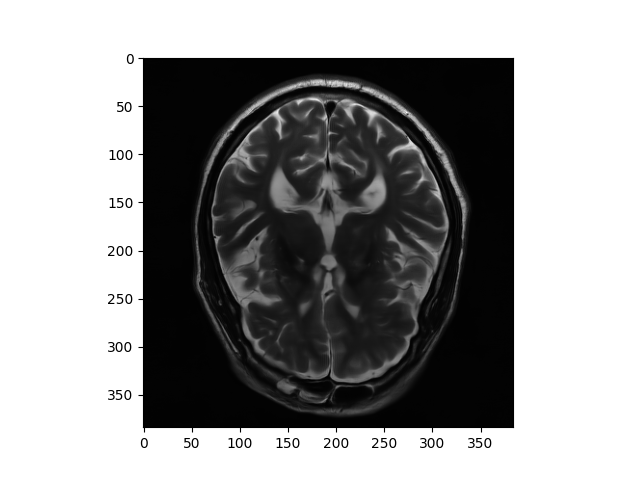

# SME-AIRS
2022 SNU Fast MRI challenge 완성 모델. 

## Architecture

## Result

  

   

The image(Left) is the raw image before passing our model. The image(Right) is the result image after passing our model. Approximately show 96.77 % accuracy for reconstructing raw input brain images. 
## Reference 
[1] Sriram, Anuroop, et al. "End-to-end variational networks for accelerated MRI reconstruction." Medical Image Computing and Computer Assisted Intervention–MICCAI 2020: 23rd International Conference, Lima, Peru, October 4–8, 2020, Proceedings, Part II 23. Springer International Publishing, 2020.

[2] Muckley, Matthew J., et al. "Results of the 2020 fastMRI challenge for machine learning MR image reconstruction." IEEE transactions on medical imaging 40.9 (2021): 2306-2317.
